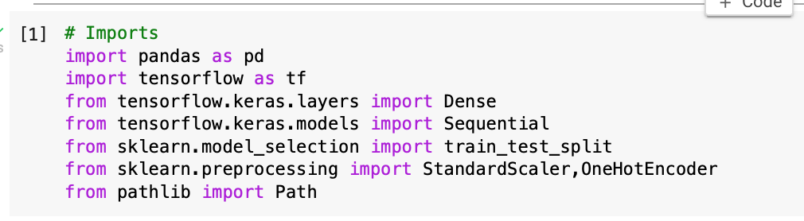
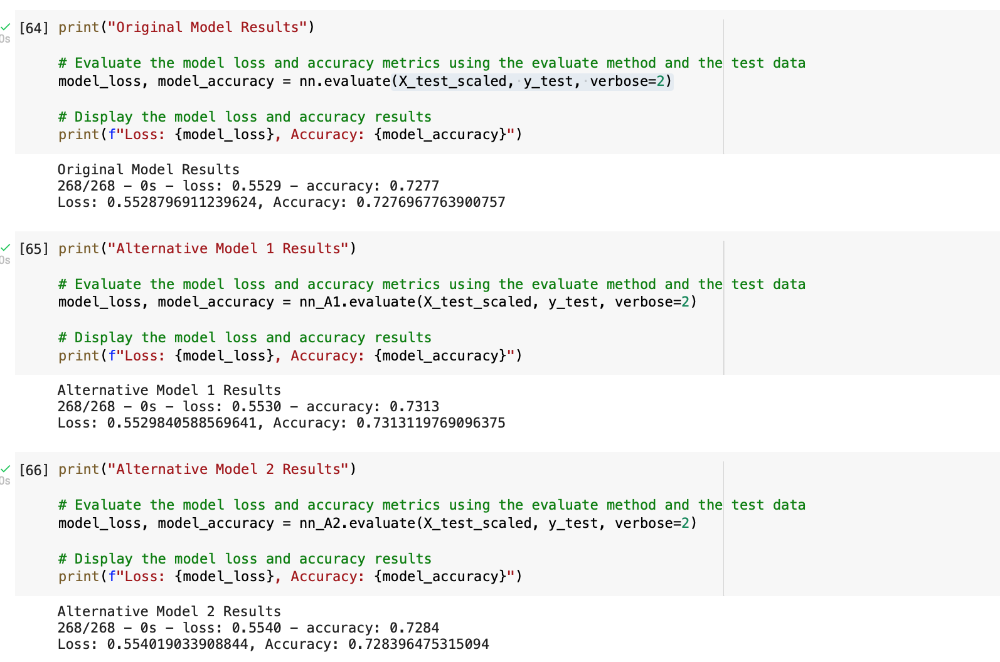

# Start-up Success Predictor
A machine learning model that predicts whether applicants will be successful if funded by a venture capital firm

# Dataset
 CSV file containing more than 34,000 organizations that have received funding from Alphabet Soup over the years. The CSV file contains a variety of information about each business, including whether or not it ultimately became successful.

 # Installation guide 

 ``` python
 pip install --upgrade tensorflow
 ```
 # Required libraries and dependencies

 

 # Examples 

 

 ## Contributors
Brought to you by Ksenia Gorska as part of the UC Berkeley Extension Bootcamp: UCB-VIRT-FIN-PT-06-2021-U-B-MW Ksenia Gorska
 e-mail: kseniagorska@icloud.com 

[linkedin](https://www.linkedin.com/in/ksenia-gorska/)

## License

MIT